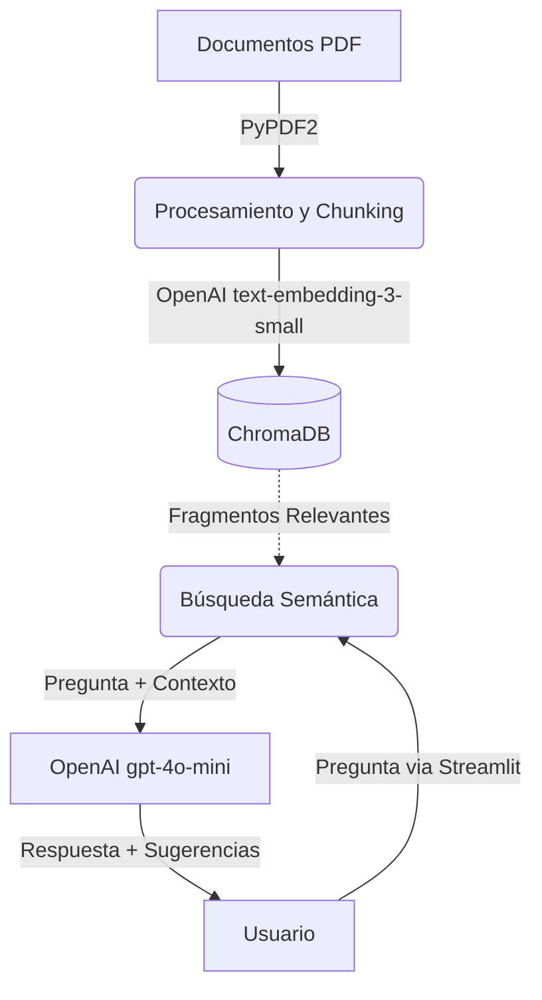
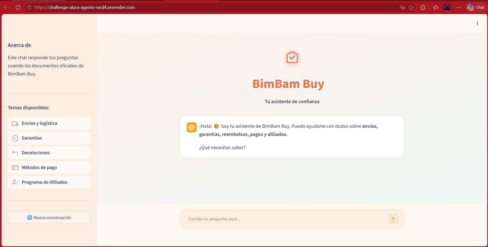
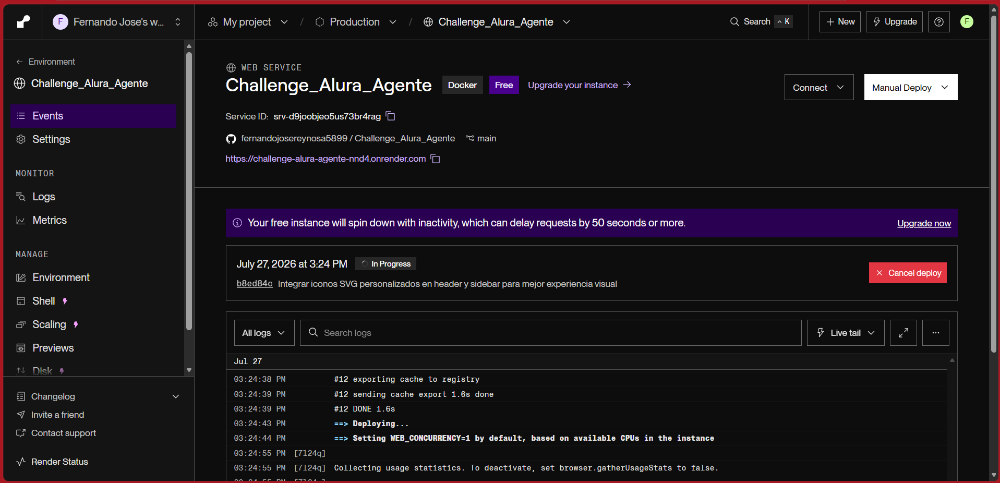

# 🛒 BimBam Buy — Agente IA Corporativo

¡Bienvenido al repositorio del Agente de Inteligencia Artificial para **BimBam Buy**! 
Este proyecto es la solución al **Challenge Alura Agente - ONE IA FOR TECH**.


## 📋 Descripción del Proyecto
Este proyecto implementa un agente corporativo basado en Inteligencia Artificial capaz de responder preguntas de los colaboradores de la empresa ficticia **BimBam Buy**. 

Utiliza la técnica **RAG (Retrieval-Augmented Generation)** para extraer respuestas **exclusivamente** de los documentos internos de la empresa, asegurando que la información sea veraz y esté siempre respaldada por las políticas oficiales. Se ha diseñado con una interfaz web cálida, hogareña y fácil de usar, incorporando iconos SVG personalizados y animaciones sutiles para una mejor experiencia de usuario.

## 🏗️ Arquitectura de la Solución

El sistema sigue un pipeline RAG clásico, compuesto por dos fases principales:



1. **Indexación (Backend de preparación):**
   - **Carga de PDFs:** Se leen 5 manuales de la empresa (Envíos, Garantías, Reembolsos, Pagos, Afiliados).
   - **Procesamiento y Chunking:** El texto se limpia y divide en fragmentos lógicos manteniendo un solapamiento para no perder contexto.
   - **Embeddings:** Se usa la API de OpenAI (`text-embedding-3-small`) para convertir los fragmentos en vectores numéricos.
   - **Vector Store:** Los vectores se guardan en **ChromaDB** para búsquedas ultrarrápidas en disco local.

2. **Recuperación y Generación (App en tiempo real):**
   - El usuario hace una pregunta en la interfaz cálida y responsiva de **Streamlit**.
   - La base vectorial busca los fragmentos más relevantes a la consulta.
   - Se inyecta la consulta y el contexto en el LLM (`gpt-4o-mini` de OpenAI).
   - El modelo formula una respuesta natural. Para mantener una estética limpia y corporativa, las fuentes no se muestran explícitamente en la UI, pero el agente sugiere preguntas de seguimiento (Follow-ups).

## 🛠️ Tecnologías y Herramientas
- **Lenguaje:** Python 3.11+
- **LLM y Embeddings:** OpenAI (`gpt-4o-mini`, `text-embedding-3-small`)
- **Base de Datos Vectorial:** ChromaDB
- **Interfaz Gráfica:** Streamlit (Custom UI con SVG y animaciones CSS)
- **Procesamiento de PDF:** PyPDF2
- **Despliegue (Deploy):** Docker / Render

## 🚀 Instrucciones para Ejecutar Localmente

1. **Clonar el repositorio:**
   ```bash
   git clone https://github.com/fernandojosereynosa5899/Challenge_Alura_Agente.git
   cd Challenge_Alura_Agente
   ```

2. **Crear y activar entorno virtual:**
   ```bash
   python -m venv .venv
   # Windows:
   .\.venv\Scripts\activate
   # Mac/Linux:
   source .venv/bin/activate
   ```

3. **Instalar dependencias:**
   ```bash
   pip install -r requirements.txt
   ```

4. **Configurar API Key:**
   Crea un archivo `.env` en la raíz del proyecto y pega tu clave de OpenAI:
   ```env
   OPENAI_API_KEY=sk-...tu_api_key_aqui...
   ```

5. **Ejecutar la aplicación:**
   ```bash
   streamlit run app.py
   ```
   *Nota: Al ejecutarse por primera vez, el sistema leerá automáticamente los PDFs e indexará la información. Esto puede tomar un minuto.*

## ☁️ Instrucciones de Deploy (Render)
El proyecto incluye un `Dockerfile` optimizado para desplegarse de manera gratuita en **Render**:

1. Sube este repositorio a tu GitHub.
2. Crea una cuenta en [Render.com](https://render.com/).
3. Haz clic en **New > Web Service**.
4. Conecta tu repositorio de GitHub.
5. Selecciona el entorno **Docker**.
6. En **Environment Variables**, añade tu `OPENAI_API_KEY`.
7. Haz clic en **Create Web Service**. 
En un par de minutos, tendrás un enlace público a tu agente.

## 💬 Ejemplos de Interacción

**Pregunta 1:**  
*¿Cuánto tarda un envío estándar?*  
**Respuesta:**  
Un envío estándar tarda entre 2 a 5 días hábiles en zonas urbanas principales, entre 4 a 8 días hábiles en zonas secundarias y entre 6 a 12 días hábiles en zonas de cobertura extendida.

💡 **Preguntas sugeridas:**
- ¿Qué pasa si el pedido se retrasa?
- ¿Existen envíos exprés?

**Pregunta 2:**  
*¿Qué métodos de pago aceptan?*  
**Respuesta:**  
BimBam Buy acepta los siguientes métodos de pago: Tarjeta de crédito, Tarjeta de débito, Transferencia bancaria, Pago en efectivo en puntos habilitados, y Billeteras digitales.

💡 **Preguntas sugeridas:**
- ¿Es seguro pagar con tarjeta en BimBam Buy?
- ¿Puedo pagar a meses sin intereses?

## 📸 Evidencia de Ejecución

**Agente en funcionamiento:**


**Servicio desplegado exitosamente en Render:**


---
*Desarrollado para el Challenge Alura Agente - ONE*
